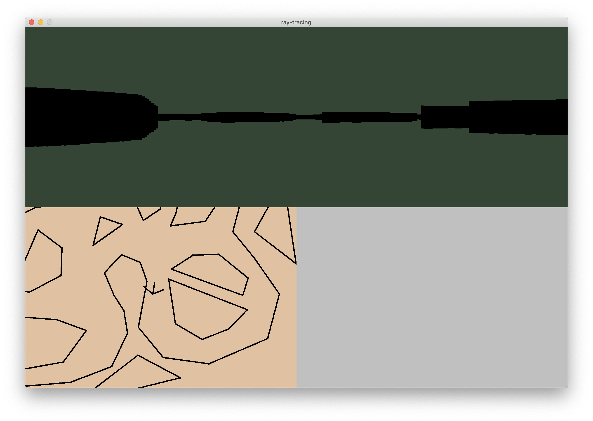

# Ray-racing

A Senior Year Computer Science I.S. Project.

## Screenshots

## Features

### Basic components

**The observer** has vision and can move and turn.

**The map** consists of edges and can be imported through Tikz.

### Ray-tracing

**Intersection detection and distance calculation** between rays (from the observer) and edges (from the map) are done through vector geometry.

**Distance-to-height transformation** is done through a semi-inverse function based on convex lens optics.

### Map display

**Fixed-camera mode** and **fixed-map mode** can be toggled.

## Controls

### Observer control

|Key|Function|
|:---:|:---|
|`W`|Move forward|
|`S`|Move backward|
|`A`|Turn counterclockwise|
|`D`|Turn clockwise|
|&#8593;|Boost forward|
|&#8595;|Boost backward|
|&#8592;|Boost counterclockwise|
|&#8594;|Boost clockwise|

### Map control

|Key|Function|
|:---:|:---|
|`-`|Zoom out|
|`=`|Zoom in|
|`\`|Toggle mode|
|`[space]`|Reset camera|

